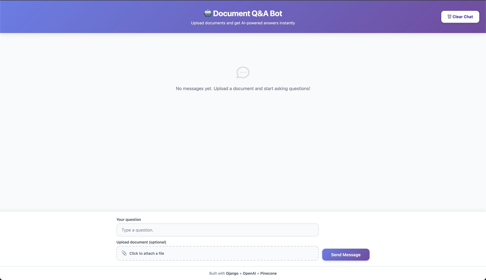
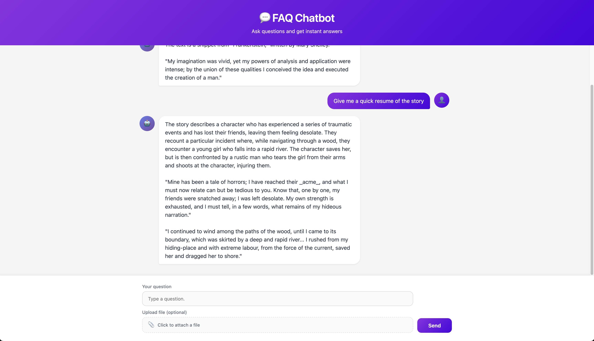

# 💬 Document Chatbot

A modern, AI-powered chatbot built with Django that lets users ask questions and receive intelligent answers grounded in their own documents. It uses Retrieval-Augmented Generation (RAG) with OpenAI models and Pinecone vector database to find relevant context and cite exact sources.

## ✨ Features

- **Intelligent Q&A** - Ask questions and get AI-generated answers with source citations
- **Document Upload** - Upload text files to expand the chatbot's knowledge base
- **Vector Search** - Uses Pinecone for efficient semantic search across documents
- **Modern UI** - Clean, responsive interface with real-time chat experience
- **Source Citations** - Every answer includes quoted sources from the knowledge base
- **Persistent Chat History** - All conversations are saved to the database

## 🛠️ Tech Stack

- **Backend**: Django 5.x (Python 3.13+)
- **AI/ML**: OpenAI GPT-4o-mini, LangChain, LangGraph
- **Vector Database**: Pinecone
- **Database**: SQLite (development)
- **Frontend**: HTML, CSS, JavaScript (Vanilla)

## 📋 Prerequisites

- Python 3.13+
- pip and virtualenv
- OpenAI API Key
- Pinecone API Key

## 🚀 Setup Instructions

### Step 1: Clone the repository
```bash
git clone git@github.com:tarbadev/document_bot.git
cd document_bot
```
### Step 2: Create and activate virtual environment
```bash
python -m venv .venv

# On macOS/Linux
source .venv/bin/activate

# On Windows
.venv\Scripts\activate
```
### Step 3: Install dependencies
```bash
pip install -r requirements.txt
```


### Step 4: Configure environment variables

Create a `.env` file in the project root:

```
OPENAI_API_KEY=your_openai_api_key_here
PINECONE_API_KEY=your_pinecone_api_key_here
```


**Getting API Keys:**
- OpenAI: Sign up at https://platform.openai.com/
- Pinecone: Sign up at https://www.pinecone.io/

### Step 5: Run database migrations

```shell script
python manage.py migrate
```


### Step 6: Create local storage directory

```shell script
mkdir local_storage
```


### Step 7: (Optional) Create superuser for admin

```shell script
python manage.py createsuperuser
```


## ▶️ Running the Application

Start the development server:

```shell script
python manage.py runserver
```


The application will be available at: **http://127.0.0.1:8000**

Access Django Admin (optional): **http://127.0.0.1:8000/admin**

## 🧭 How to Use

1. Open the application in your browser
2. Type your question in the input field
3. (Optional) Upload a document to add to the knowledge base
4. Click "Send" to get an AI-generated answer with citations
5. View chat history - all messages are saved and displayed

## 🚢 Deploying to Render.com

Commit and push on the `main` branch to deploy to Render.com.
Once deployed, it should be accessible at `https://document-bot-na6n.onrender.com`.

## 🖼️ Screenshots




## 🧪 Tips & Troubleshooting

- **Virtual environment not activated**: Make sure to activate your virtual environment before running commands
- **Invalid API Key error**: Verify that your `.env` file contains valid API keys and is in the project root
- **Pinecone Index error**: The application automatically creates the index on first run. Wait a few moments for initialization
- **ModuleNotFoundError**: Ensure all dependencies are installed in your virtual environment
- **Static files not loading**: Run `python manage.py collectstatic` if deploying to production


## 📝 License

This project is licensed under the [MIT License](./LICENSE) — you are free to use, modify, and distribute it with attribution.

---

Built with ❤️ using Django, OpenAI, and Pinecone  
**Tested on:** Python 3.11 (recommended), Django 5.2.x, macOS/Ubuntu.
